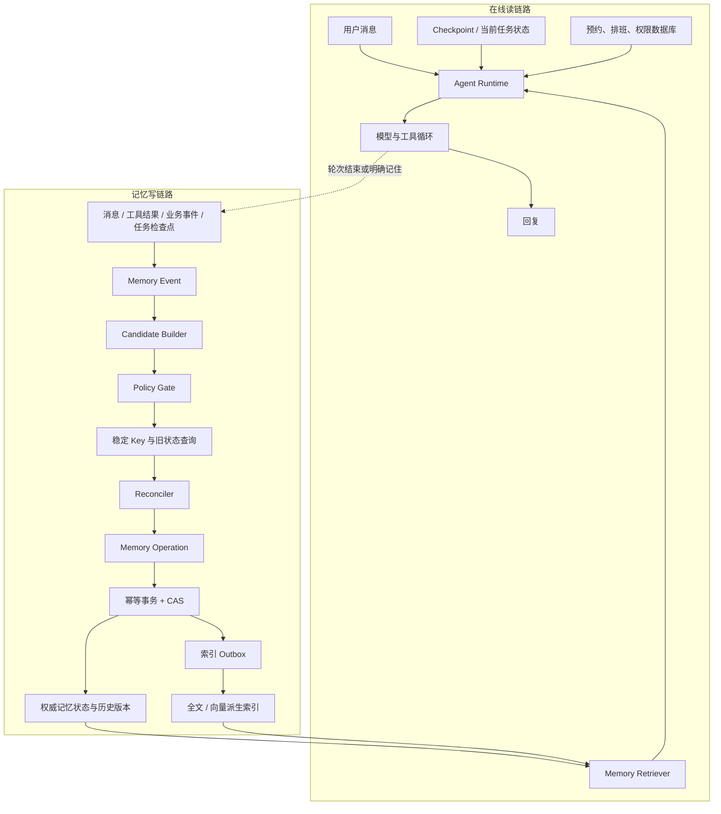

# 企业机房与办公电脑维修 Agent：记忆系统工程化设计

本文把项目中原有的“最近 10 轮、窗口占用 60% 时摘要、长期记忆召回 Top-5”扩展成一套完整的读写协议。重点不是先选向量库，而是回答：什么信息值得记、由谁授权、何时可见、如何处理冲突、怎样删除，以及出现错误后如何解释和恢复。

> 证据边界：当前目录没有可运行的长期记忆服务、数据库表、异步 Worker 或评测报告。下文是与现有机房与电脑维修 Agent 架构对齐的**目标设计与分阶段实施方案**，不能表述为已经上线。

## 1. 先明确记忆在项目中的位置

模型只负责当前调用中的推理，不会因为回答“我记住了”就自动获得跨会话状态。记忆是 Agent Runtime 外围的一套状态服务，读链路和写链路分开：



这套项目同时存在五类容易混淆的数据：

| 数据 | 内容 | 范围 | 权威性 |
|---|---|---|---|
| History | 原始聊天消息 | 当前会话 | 证据，不是业务事实 |
| Agent State / Checkpoint | 当前阶段、槽位、待确认动作、工具结果引用 | 当前任务或 thread | 工作流恢复依据，不是业务事实 |
| Summary | 对早期消息的有损压缩 | 当前会话 | 低于最新原文和结构化状态 |
| Long-term Memory | 跨会话偏好、稳定事实、事件摘要、经验证经验 | 用户、租户或 Agent | 辅助上下文，可能陈旧或被污染 |
| Business Database | 预约、排班、工程师、权限、联系方式原始记录 | 业务域 | 最终事实源 |

预约是否成功、工程师是否有空、用户是否有权限，永远回查业务数据库。记忆只能帮助理解和个性化，不能替代事务校验。

## 2. 本项目应该记什么，不应该记什么

### 2.1 四类长期记忆与一类任务状态

| 类型 | 项目示例 | 稳定 Key | 默认保留策略 |
|---|---|---|---|
| Semantic Fact | 用户负责的常用电脑/服务器型号、经过确认的机房位置与服务区域 | `subject + field` | 版本化；被新事实取代时旧版本失效 |
| Preference | 尽量避开周末、偏好短信联系、偏好上午上门 | `subject + preference_field + applicability` | 有效期或定期复核；例外不覆盖长期偏好 |
| Episodic Event | 完成一次服务器启动故障咨询、发生一次维修预约改期 | `event_id` | 带 TTL；只保存必要摘要和维修工单引用 |
| Procedural Memory | 某类故障经过验证的排查步骤、稳定工具使用经验 | `tenant/agent + procedure + version` | 需要可信来源、评审、版本和回归测试 |
| Task Checkpoint | 当前已完成咨询、仍缺地址、等待确认 | `thread_id + task_id` | 属于 Checkpointer；任务结束后按策略过期 |

程序性记忆不能由一次对话自动晋升。它可能改变所有用户后续的 Agent 行为，因此应采用更严格的可信来源、人工评审和回归发布流程。

### 2.2 明确禁止或谨慎保存

- 密码、验证码、Token、支付信息和认证凭据禁止进入记忆。
- 手机号、详细地址、健康信息等敏感字段默认只进入受控业务表；只有明确业务目的、用户许可和保留期时才建立受限引用，不把原文复制进向量索引。
- 预约状态、工程师排班和权限不从对话推断，也不写成可覆盖事实源的记忆。
- RAG 文档里的指令、未经验证的工具输出和第三方文本不得自动晋升为用户偏好或程序规则。
- 一次情绪、一次性细节、模型猜测和没有证据来源的结论默认拒绝长期保存。

## 3. 统一的四个架构对象

### 3.1 Memory Event：保存“发生了什么”

事件是不可变证据层。Runtime 在消息接收、工具完成、业务事件提交或任务阶段变化时创建事件；此时不判断它是不是长期事实。

```json
{
  "event_id": "evt_01...",
  "event_type": "user_message",
  "occurred_at": "2026-08-19T10:30:00+08:00",
  "scope": {
    "tenant_id": "t_1",
    "user_id": "u_7",
    "agent_id": "after_sales",
    "session_id": "s_9",
    "task_id": "task_12"
  },
  "source": {
    "kind": "message",
    "source_id": "msg_88",
    "actor": "user"
  },
  "payload_ref": "encrypted://conversation/msg_88",
  "policy_context": {
    "purpose": "after_sales_service",
    "consent_version": "v3",
    "data_class": "internal"
  },
  "trace_id": "trace_..."
}
```

`scope`必须由认证后的应用运行时注入，不能让模型根据“替张三记一下”自行选择写入对象。原文可以放在短保留期、加密、细粒度授权的证据存储中；事件层保存引用和必要摘要。

### 3.2 Memory Candidate：表达“可能值得记什么”

Candidate Builder 根据固定 Schema 生成原子候选，一条候选只表达一件可独立判断和更新的事：

```json
{
  "candidate_id": "cand_01...",
  "event_id": "evt_01...",
  "memory_type": "preference",
  "subject": {"type": "user", "id": "u_7"},
  "field": "preferred_service_window",
  "value": "weekday_morning",
  "applicability": "default",
  "valid_from": "2026-08-19T10:30:00+08:00",
  "evidence": [{"source_id": "msg_88", "quote_hash": "sha256:..."}],
  "confidence": 1.0,
  "sensitivity": "normal",
  "proposed_ttl_days": 180
}
```

模型只能输出预定义的类型、字段和枚举；Pydantic/业务代码负责 Schema、作用域和时间校验。Candidate 不是已提交记忆。

### 3.3 Committed Memory：保存当前状态和历史版本

```text
memory_id
namespace: tenant_id + subject_id
memory_type
memory_key
value_json
status: ACTIVE | INVALIDATED | DELETED
valid_from / valid_to
source_event_id
confidence / sensitivity / expires_at
version
created_at / updated_at
```

可变事实和偏好采用时间化版本，不物理覆盖旧值。例如新的服务城市生效后，旧城市设置`valid_to`并变为`INVALIDATED`，从而可以解释过去某次回答为什么使用了旧值。

### 3.4 Memory Operation：唯一、可审计的写入决定

Reconciler 对同一 scope、同一稳定 Key 的候选与旧状态比较，最终只输出一个结构化操作：

| 操作 | 含义 |
|---|---|
| `ADD` | 没有同 Key 的有效状态，新增一条 |
| `UPDATE` | 同一状态得到补充或更可靠的新值，写入新版本 |
| `INVALIDATE` | 旧状态从指定时间起不再有效，但保留历史 |
| `DELETE` | 用户删除或治理要求；执行逻辑删除或合规物理擦除 |
| `NOP` | 重复或等价信息，不重复写 |
| `REVIEW` | 证据、冲突或权限不足，进入复核而不是猜测 |

```json
{
  "operation_id": "op_01...",
  "candidate_id": "cand_01...",
  "action": "UPDATE",
  "memory_key": "user:u_7:preference:preferred_service_window:default",
  "expected_version": 2,
  "new_version": 3,
  "reason_code": "EXPLICIT_USER_CORRECTION",
  "source_event_id": "evt_01..."
}
```

## 4. 什么时候写：同步与异步共用同一协议

同步和异步不是两套记忆模型，只是同一写入协议的不同执行时机。

### 4.1 同步写入

以下信息在下一轮必须可见，走同步快速路径：

- 用户明确说“请记住”“以后都这样”或明确纠正、删除；
- 当前任务阶段、已确认槽位、待确认动作等 Checkpoint；
- 工具或数据库刚提交的关键结果引用；
- 下一轮规划必需且若延迟会造成错误的状态。

同步路径仍然先创建 Event，再走 Candidate、Policy、Reconcile 和 Commit；不能直接把模型摘要写入 Store。为控制响应延迟，同步路径只处理少量高价值、确定性候选。

### 4.2 异步写入

以下信息可在轮次结束、会话结束或业务事件发生后异步处理：

- 普通咨询摘要与重复信息合并；
- 多次行为形成的偏好候选；
- TTL 过期、低价值记忆清理和置信度衰减；
- 多次验证经验向程序性记忆的晋升候选；
- Schema 或提取模型升级后的重放和重新派生。

异步 Worker 必须处理重复投递、队列积压、有限重试、死信与水位恢复。用户刚明确要求记住的内容不依赖异步最终一致性。

## 5. Policy Gate：先做确定性规则，再让模型判断模糊价值

建议按以下顺序执行：

1. **作用域与授权**：租户、用户、Agent、会话和任务是否来自可信 Runtime；调用者是否有写权限。
2. **用户意愿与用途**：是否明确拒绝记忆，是否超出机房与电脑维修服务目的，是否允许跨会话使用。
3. **隐私与合规**：敏感级别、最小化、保留期限、加密和删除要求。
4. **Schema 白名单**：类型、字段、值域、长度和证据引用是否合法。
5. **来源可信度**：用户明确陈述、业务服务成功事件、工具输出、模型推断使用不同优先级。
6. **未来价值**：以后是否可能用于个性化或任务恢复，是否只是一次性细节。
7. **保留策略**：长期、短期 TTL、仅当前会话或不保存。

输出只能是`ACCEPT`、`REJECT`或`REVIEW`，并带`reason_code`。权限、敏感字段和禁止类型由确定性规则裁决；模型只辅助处理“是否具有长期价值”等模糊问题，不能替代安全边界。

## 6. 稳定 Key、冲突与并发

### 6.1 先归一化身份，再做语义相似检索

“周末不要安排”“本周六可以”“上次周六维修”在向量空间里很相似，但语义角色不同。可变状态必须先形成稳定 Key：

```text
Preference  → tenant + user + field + applicability
Semantic    → tenant + subject + entity + field
Episodic    → tenant + event_id
Checkpoint  → tenant + user + thread + task
Procedural  → tenant/agent + procedure_name + version
```

向量相似度用于补充发现相关记忆，不能作为可变事实的唯一身份模型。

### 6.2 项目中的冲突规则

以用户先说“以后尽量不要安排周末”，后说“这周六可以”为例：

- 长期默认偏好仍是`avoid_weekend=true`；
- 当前任务增加`session_exception=2026-08-22`；
- 例外只对本次任务有效，不更新长期默认偏好；
- 如果用户明确说“以后周末也可以”，才对长期偏好生成新版本并使旧版本失效。

推荐的读取优先级是：

```text
业务数据库事实
> 当前会话中最新、明确、已授权的用户指令
> 当前结构化任务状态和有效确认
> 有来源、有适用范围的长期记忆
> 会话摘要和模型推断
```

### 6.3 幂等与乐观并发控制

- `event_id`唯一：队列重复投递不产生第二份事件。
- `candidate_id`可由`event_id + schema_version + ordinal`稳定派生，提取重试可去重。
- `operation_id`唯一：事务超时重试不能重复执行操作。
- `memory_key + version`做 CAS：`UPDATE ... WHERE version = expected_version`。
- CAS 失败时重读新状态、重新 Reconcile，不能静默覆盖。
- 后台租约 Worker 使用 fencing token，存储层拒绝旧持有者写入。

## 7. 存储职责：先有权威状态，再建派生索引

首版可以继续使用 SQLite 验证协议，不需要一开始引入图数据库。建议至少建立：

```text
memory_event      不可变事件与证据引用，UNIQUE(event_id)
memory_record     当前状态与历史版本，UNIQUE(namespace, memory_key, version)
memory_operation  追加式变更日志，UNIQUE(operation_id)
memory_outbox     等待更新派生索引的任务
memory_review     需要人工或高置信流程复核的候选
```

一次成功提交应在同一短事务中：

```text
校验 operation_id 幂等
→ 检查 expected_version
→ 写新版本并失效旧版本（若需要）
→ 追加 operation log
→ 写 memory_outbox
→ COMMIT
```

全文、向量和图索引只是检索视图，可以延迟更新，也必须能从`memory_record + memory_operation`重建。首版用结构化 Key 查询和 SQLite FTS5 即可；只有语义召回评测证明价值后再接 Embedding/向量索引。PostgreSQL 是多实例和更高写并发的生产演进方案。

## 8. 读路径与上下文预算

一次请求的上下文组装顺序建议为：

1. 从可信 Runtime 注入 tenant、user、session、task 和权限范围；
2. 加载 Checkpoint 中的当前阶段、槽位、确认和工具结果引用；
3. 保留最近 10 轮原文，并在实际 Token 窗口使用率达到 60% 时压缩更早内容；
4. 根据当前意图生成记忆查询，只检索需要的类型和字段；
5. 先做 namespace、ACL、状态、有效期和 TTL 过滤；
6. 再按语义相关性、新近性、重要度、置信度和来源质量排序，首版最多注入 Top-5；
7. 去重、解决冲突，并给每条记忆附`memory_id`、来源和适用范围；
8. 把 Memory 放入明确的`UNTRUSTED_CONTEXT`区，执行工具前重新校验业务事实。

原材料中的`0.6×语义相关性 + 0.3×时间 + 0.1×重要度`可以作为离线实验起点，不应硬编码为永恒规则。10 轮、60% 和 Top-5 也要用长对话回归集做消融。

## 9. 用户控制、删除和重新派生

用户应能查看“系统记住了什么”、来源、用途和有效期，并能更正、删除或关闭某类记忆。

- “忘记我的周末偏好”生成确定性的`DELETE`操作，经过同一权限、事务和索引 Outbox 链路。
- 删除请求应传播到当前状态、全文/向量索引、缓存和依法需要处理的备份流程，并记录完成状态。
- 若业务记录因法定或履约需要不能立即物理删除，应明确区分“业务记录保留”和“停止作为 Agent 记忆使用”。
- 提取模型或 Schema 升级时，可以重放不可变 Event 重新生成候选；新旧派生版本要可区分、可回滚。

## 10. 可观测性与评测

### 10.1 Trace 和审计

一条完整链路关联：

```text
trace_id
  → event_id
  → candidate_id
  → operation_id
  → memory_id + version
  → index_outbox_id
```

系统要能回答：为什么写入、为什么拒绝、基于哪条证据、覆盖了哪个版本、何时进入检索索引、谁执行了删除。日志默认只记录 ID、Schema 版本、reason code、耗时和脱敏摘要，不记录秘密、完整手机号或详细地址。

### 10.2 三组指标

| 维度 | 核心指标 |
|---|---|
| 质量 | 写入准确率、漏写率、重复率、冲突处理正确率、陈旧记忆召回率、下游任务成功率 |
| 安全 | 跨租户召回数、敏感信息误写率、恶意内容晋升率、更正/删除完成率 |
| 运行 | 同步写 P95、异步队列最老年龄、重试/死信率、CAS 冲突率、索引同步延迟 |

评测集至少覆盖：明确记住、明确拒绝记忆、一次性例外、长期偏好纠正、两个会话并发更新、重复事件、乱序事件、恶意 RAG 指令、敏感字段、删除后召回、索引延迟和旧 Worker 恢复写入。

## 11. 适合当前项目的分阶段落地

### 阶段 0：先把边界说清

- 保留现有 Checkpoint、最近 10 轮和滚动摘要设计；
- 预约、排班、权限继续以业务数据库为准；
- 明确长期记忆目前只是目标设计。

### 阶段 1：最小可验证写入闭环

- 只支持 2～3 个低风险字段，如`preferred_service_window`、`preferred_contact_channel`；
- 实现`memory_event → policy → operation → memory_record`；
- 支持明确记住、更正、删除、`NOP`去重和版本 CAS；
- 用结构化 Key 读取，不先引入向量库；
- 增加跨租户、重复投递、并发纠正和删除测试。

### 阶段 2：异步提取和派生索引

- 增加轮次结束 Worker、Outbox、重试、死信和水位；
- 引入有限的事件摘要与 TTL；
- 先用 FTS5，再以离线评测决定是否增加向量召回；
- 增加用户可查看、更正和删除的管理接口。

### 阶段 3：巩固与生产演进

- 多次会话形成偏好候选，但明确用户陈述优先；
- 程序性记忆采用评审、版本和回归发布；
- 迁移 PostgreSQL、共享 Worker、完整 OTel Trace 和审计；
- 用真实失败样本和消融结果调节窗口、摘要阈值、Top-K 与评分权重。

## 12. 面试口述版

> 我没有把记忆理解成“把聊天记录扔进向量库”。在线读链路负责把当前 Checkpoint、最近对话和经过过滤的长期记忆组装进上下文；写链路先把用户消息、工具结果和业务事件保存成不可变 Memory Event，再按固定 Schema 生成原子 Candidate。系统先做租户作用域、授权、敏感信息、来源和保留期检查，然后用稳定 Memory Key 找旧状态，输出 ADD、UPDATE、INVALIDATE、DELETE、NOP 或 REVIEW 中唯一一个操作。事务用 operation_id 保证幂等，用 version CAS 防止两个会话互相覆盖，并同时写操作日志与索引 Outbox。结构化状态是权威记忆源，向量和全文只是可重建的检索视图；预约和排班仍以业务数据库为最终事实。首版只做少量低风险偏好和明确记住/删除，异步巩固、向量检索和程序性记忆等有真实评测收益后再增加。

## 13. 七问检查清单

1. 记忆触发发生在消息、工具、业务事件还是任务检查点？同步还是异步？
2. scope 由谁注入，能否证明不会写到另一个租户或用户？
3. Candidate Schema 是否原子、白名单化，并带来源、时间和保留策略？
4. 每种记忆的稳定 Key 是什么，如何区分默认偏好和一次性例外？
5. 写入前如何查询旧状态、判断等价、补充、冲突和来源优先级？
6. 事务如何保证 operation 幂等、版本 CAS、历史可追溯和索引最终一致？
7. 用户如何查看、更正、删除，系统如何度量质量、安全和运行状态？
