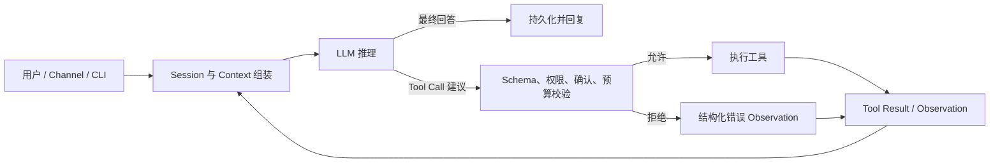

# OpenClaw、Claude Code、Hermes Agent、Pi：Agent 项目高频面试重点

> 核验时间：2026-08-10。本文只讲面试最常追问的架构与工程问题，不做安装手册，也不逐文件解释全部源码。

> 项目映射场景：将这些通用 Agent Harness 的设计经验用于企业机房、服务器与办公电脑维修 Agent，不把编程 Agent 的高权限工具直接照搬到维修业务。

## 0. 先把项目身份说准确

| 项目 | 当前定位 | 开源口径 | 最值得学习的面试主题 |
|---|---|---|---|
| [OpenClaw](https://github.com/openclaw/openclaw) | 以 Gateway 为控制面的跨渠道个人 Agent | MIT，完整公开仓库 | Gateway、会话并发、持久记忆、消息入口与高权限工具的安全边界 |
| [Claude Code](https://github.com/anthropics/claude-code) | Anthropic 的通用编程 Agent Harness | **公开仓库不等于开源**；仓库许可证是 All rights reserved | Gather → Act → Verify、权限模式、Checkpoint、上下文压缩、MCP/Skills/Hooks/Subagents |
| [Hermes Agent](https://github.com/NousResearch/hermes-agent) | Nous Research 的跨渠道、自学习型通用 Agent | MIT，完整公开仓库 | Provider 适配、工具并发、压缩、记忆与技能学习、Gateway 与定时任务 |
| [Pi](https://github.com/earendil-works/pi) | 极简、可自扩展的 Agent Harness 与 Coding Agent | MIT；旧地址 `badlogic/pi-mono` 已重定向到当前仓库 | 最小 Agent Loop、事件流、工具调度、树形 Session、扩展 API |

最容易答错的是 Claude Code。它的产品仓库可以访问，也包含插件、示例和问题跟踪，但 [LICENSE](https://github.com/anthropics/claude-code/blob/main/LICENSE.md) 明确保留全部权利，不能说“我阅读了 Claude Code 完整开源内核”。[Claude Agent SDK Python](https://github.com/anthropics/claude-agent-sdk-python) 的包装层使用 MIT 许可证，但它会调用或捆绑 Claude Code CLI，仍不能据此推断产品内核源码。

面试时可以这样说：

> OpenClaw、Hermes 和 Pi 可以做源码级比较；Claude Code 只能依据官方行为文档、公开扩展仓库和 SDK 接口分析。对无法验证的内部调度实现，我不会包装成源码事实。

## 1. 四个项目共同的核心：Agent Harness

LLM 只是给出文本或 Tool Call 的模型。真正让它成为 Agent 的是 Harness：组装上下文、暴露工具、执行权限检查、运行循环、持久化会话、处理取消和失败。



这张图要能口述成一句话：

> 每一轮把受控上下文发给模型；模型若返回工具调用，应用层先校验再执行，把结果作为 Observation 放回上下文继续循环；模型返回最终文本、达到预算、被取消或发生不可恢复错误时结束。

面试官真正想听的不是“用了 ReAct”，而是下面四点：

1. 模型只**建议**动作，应用才有执行权。
2. 循环有停止条件、超时、取消和预算。
3. 会话历史、运行时 Context、长期 Memory、业务事实不是一回事。
4. Prompt 是软约束；权限、沙箱、幂等和数据隔离必须由确定性代码保证。

## 2. 项目一：OpenClaw——重点看 Gateway、会话并发与安全

### 2.1 一句话定位

OpenClaw 不是单纯的终端 Coding Agent。它把 WhatsApp、Telegram、Slack、Discord、WebChat、CLI、设备节点等入口接到一个长期运行的 Gateway，再由 Gateway 管理会话、工具、事件和 Agent Run。官方架构把 Gateway 定义为本地控制面。

### 2.2 高频架构主线

一次请求可以概括为：

```text
Channel / CLI
  → Gateway 校验、鉴权、解析 sessionKey
  → 按 Session Lane 排队
  → 准备 workspace、skills、bootstrap context
  → 运行 Agent Loop
  → 流式转发 assistant/tool/lifecycle 事件
  → 持久化 transcript
  → 回到原 Channel
```

这里有三个面试亮点。

第一，**控制面集中**。渠道连接、会话和节点都通过 Gateway，协议和策略只维护一套。代价是 Gateway 成为故障域和高价值攻击面，所以需要进程监管、健康检查、网络绑定和鉴权。

第二，**同一会话串行化**。官方 Agent Loop 文档说明 Run 会进入 per-session lane，必要时再进入 global lane，避免两个请求同时改写同一会话或并发使用有状态工具。当前实现还用 `activeWriterRunId` 一类 writer claim 做 fencing：旧 Run 即使稍后恢复，也不能提交已经过期的 transcript。

第三，**副作用请求需要幂等**。Gateway 协议要求 `send`、`agent` 等副作用方法带 Idempotency Key，并维护短期去重。它解决的是重复提交，不等于外部系统的严格 Exactly Once。

### 2.3 Memory 不等于 Transcript

OpenClaw 的长期记忆以工作区 Markdown 为事实载体：`USER.md` 保存稳定用户偏好，`MEMORY.md` 保存精选长期事实，`memory/*.md` 保存更详细的工作记录。检索工具再通过关键词、向量或混合搜索按需读取。官方文档明确说明“没有隐藏记忆；只有写入磁盘的内容才会留下”。

压缩前可以先触发 memory flush，把仍在对话里的重要事实写入长期文件，再对旧对话做有损摘要。这个设计体现了两个高频原则：

- Compaction 解决的是**当前模型窗口**，Memory 解决的是**跨会话召回**；
- 摘要可能丢信息，权限、审批和业务事实不能只存在摘要里。

长期记忆还有一个更深的安全点：写路径要做来源治理，不能让“不可信内容被多次召回”就自动晋升为永久规则。OpenClaw 的 Memory Core 会记录来源，并在长期记忆整理前确定性排除不可信候选。面试时可把它概括为：**检索防泄漏发生在读路径，记忆防投毒还必须发生在写路径。**

### 2.4 安全边界是本项目最值得追问的部分

OpenClaw 官方安全模型默认是“一个 Gateway 对应一个可信操作者边界”，并不把共享 Gateway 当作敌对多租户隔离边界。默认主会话的工具可能在宿主机运行；沙箱需要明确配置。

因此生产回答不能只说“有 System Prompt 防注入”。更完整的顺序是：

1. Channel pairing、allowlist、mention gate 控制谁能触发；
2. Session scope 控制不同发送者是否共享上下文；
3. Tool policy、approval、workspace-only 和 sandbox 控制能做什么；
4. 高风险工具与读取不可信内容的 Agent 分离；
5. 多个互不信任租户使用独立 Gateway，最好再分 OS 用户或主机。

还要分清三个常被混用的控制：**Tool Policy** 决定哪些能力暴露给模型，**Sandbox** 决定工具在哪里运行，**Elevated** 是沙箱内 `exec` 逃逸到宿主机或节点的例外通道。三者互不替代；例如只禁用 `write/edit` 并不能把 `exec` 变成只读，因为 Shell 自身仍可修改文件。Plugin 又是 Gateway 进程内的可信代码，也不能当作沙箱脚本。

### 2.5 建议阅读路径

| 先后 | 文件或文档 | 只看什么 |
|---|---|---|
| 1 | [Gateway architecture](https://docs.openclaw.ai/concepts/architecture) | Gateway、Client、Node、WebSocket 协议和幂等 |
| 2 | [Agent loop](https://docs.openclaw.ai/concepts/agent-loop) | Run、Session Lane、Writer Fence、事件流和超时 |
| 3 | [Memory](https://docs.openclaw.ai/concepts/memory) 与 [Memory architecture](https://docs.openclaw.ai/concepts/memory-architecture) | Memory 文件、检索、flush、compaction 与写路径防投毒 |
| 4 | [Security](https://docs.openclaw.ai/gateway/security) 与 [Sandbox vs Tool Policy vs Elevated](https://docs.openclaw.ai/gateway/sandbox-vs-tool-policy-vs-elevated) | 单操作者信任模型、Prompt Injection、能力与执行位置边界 |
| 5 | [`src/agents/agent-command.ts`](https://github.com/openclaw/openclaw/blob/main/src/agents/agent-command.ts) 与 [`src/agents/embedded-agent-runner/`](https://github.com/openclaw/openclaw/tree/main/src/agents/embedded-agent-runner) | 从 RPC 到实际 Run 的编排 |

### 2.6 最常见追问

**问：为什么需要 Gateway，Channel 直接调用模型不行吗？**

可以，但会把会话、权限、工具、模型配置、流式事件和渠道重试分散到每个适配器。Gateway 统一控制面，让 Channel 只负责收发；代价是集中故障域，需要高可用与严格暴露面管理。

**问：为什么“同一 Session 串行”比加锁工具更可靠？**

因为冲突不只发生在某个工具，还发生在上下文读取、模型决策、Transcript 追加和压缩重写之间。Session Lane 先消除大部分会话级竞态，Writer Fence 再阻止旧 Run 提交陈旧结果；具体业务写入仍需数据库约束和幂等。

**问：OpenClaw 能直接做企业多租户平台吗？**

不能把默认个人助手模式直接等同于敌对多租户安全边界。共享 Gateway 内的 Operator 权限很高，`sessionKey` 只是路由标识，不是授权令牌。多租户至少需要独立身份、数据访问层和每租户隔离的 Gateway Cell。

## 3. 项目二：Claude Code——重点看官方行为，不虚构闭源内核

### 3.1 一句话定位

Claude Code 是围绕 Claude 模型构建的 Agent Harness。官方把循环概括为 **Gather Context → Take Action → Verify Results**：先搜索和读取代码，再编辑或执行命令，最后用测试、类型检查或用户给出的验收标准验证，必要时继续循环。

### 3.2 面试最值得讲的四件事

**一是 Harness 与模型分工。** 模型负责理解与选择下一步；Claude Code 提供工具、Context 管理、运行环境、权限和 Session。把“Claude 模型能力”与“Claude Code 工程能力”分开，是回答 Agent 架构题的基础。

**二是上下文按成本分层。** 会话消息、文件内容、命令输出、`CLAUDE.md`、Auto Memory、Skills 和工具定义都会占窗口。官方文档说明，接近上限时先清理旧 Tool Output，再摘要对话；MCP 工具定义默认按需加载；Subagent 使用独立 Context，只把最终结果或报告返回主会话，不携带全部执行轨迹。

**三是可恢复性分层。** Session 以本地 JSONL 保存，支持 resume 和 fork；文件编辑前创建 Checkpoint，可以回退文件。但远端 API、数据库、部署等外部副作用无法靠文件 Checkpoint 撤销，必须另做确认、幂等或补偿。

**四是权限优先于 Prompt。** Claude Code 默认强调只读起步，对编辑、Shell、网络等动作按模式请求批准，并支持工作目录边界与沙箱。这里要区分三层：Permission 决定工具调用是否获准；Sandbox 主要约束 Bash 及其子进程的文件和网络访问，并不直接包住内置 `Read/Edit/Write`；Checkpoint 只恢复文件。即使三层都启用，MCP Server 和外部内容仍是供应链与 Prompt Injection 风险。

还有一个常见 API 陷阱：Agent SDK 的 `allowedTools` 更接近“自动批准列表”，不等于完整的工具可见性白名单；未列出的工具仍可能进入正常权限判断。需要明确阻止工具时使用 `disallowedTools`，而 Subagent 配置中的 `tools` 才用于收窄它实际获得的能力。回答权限题时一定先确认字段语义，不能见到 `allow` 就默认它是能力隔离。

### 3.3 Skills、Hooks、MCP、Subagents 怎么区分

| 机制 | 解决什么 | 典型例子 |
|---|---|---|
| `CLAUDE.md` / Rules | 向相应 Context 注入项目事实和约定；仍是模型指令而非硬权限 | 测试命令、目录边界、编码规范 |
| Skill | 按需加载的可复用流程知识 | PR Review、发布检查 |
| Hook | 在生命周期事件上触发 Command/HTTP 或模型型 Handler | 编辑后格式化、提交前检查、模型评审 |
| MCP | 把外部数据或动作暴露为标准工具 | Jira、数据库、内部平台 |
| Subagent | 用独立 Context 承担可隔离子任务 | 搜索一个模块、并行调研、专项评审 |

面试中不要回答成“它们都能扩展功能”。要说清：Skill 主要提供过程知识；Hook 提供事件插点，其中 Command/HTTP Handler 可做确定性检查，Prompt/Agent Handler 仍依赖模型判断；MCP 提供外部能力边界；Subagent 提供上下文和任务隔离。

### 3.4 可核验的阅读路径

| 先后 | 官方资料 | 只看什么 |
|---|---|---|
| 1 | [How Claude Code works](https://code.claude.com/docs/en/how-claude-code-works) | 三阶段循环、Tools、Session、Compaction、Checkpoint |
| 2 | [Security](https://code.claude.com/docs/en/security) | 权限、工作区边界、Sandbox、Prompt Injection、MCP |
| 3 | [Claude Code repository](https://github.com/anthropics/claude-code) | 插件、示例、Changelog；不要声称这里有完整内核 |
| 4 | [Claude Agent SDK Python](https://github.com/anthropics/claude-agent-sdk-python) | SDK Client、消息类型、Hook 与 Permission 接口 |

### 3.5 最常见追问

**问：为什么 Verification 是 Agent Loop 的正式阶段？**

因为“成功调用 edit 工具”只证明文件发生了变化，不证明任务正确。测试、编译、Lint、截图或业务断言会产生新的 Observation，让模型能够纠错。没有可验证反馈的循环容易在“看起来完成”时提前结束。

**问：Context 很大时，全部历史直接发给模型不行吗？**

成本和延迟会持续增长，旧 Tool Output 还会淹没真正约束。更合理的是保留持久规则、近期原文和关键结构化状态，裁剪可再获取的输出，按需加载 Skills/MCP，并把独立研究交给 Subagent。

**问：Checkpoint 能保证所有 Agent 操作都可回滚吗？**

不能。它适合恢复本地文件，不会自动撤销已经发送的消息、数据库更新、Git Push 或部署。外部副作用要有独立的确认、幂等键、状态查询和补偿流程。

## 4. 项目三：Hermes Agent——重点看 Provider 适配、压缩和学习闭环

### 4.1 一句话定位

Hermes 是 Python 为主的通用 Agent。CLI、消息 Gateway、定时任务和 Subagent 最终复用同一套 Agent 能力；它特别强调跨模型 Provider、持久记忆、Session Search，以及把重复流程沉淀为 Skill。这里的“Self-improving”默认指外部 Memory 与程序性 Skill 的积累，不是在线更新模型权重。

### 4.2 核心 Agent Loop

官方开发文档把核心编排集中在 `run_agent.py` 的 `AIAgent`。一轮大致是：

1. 追加用户消息；
2. 组装或复用 System Prompt；
3. 预估 Context，必要时先压缩；
4. 把统一内部消息转换成目标 Provider 格式；
5. 发起可中断模型调用；
6. 若返回 Tool Calls，执行并追加 Tool Results；
7. 若返回最终文本，尝试持久化当前 Session 后结束；内置 Memory 只有经 `memory` 工具或后台 review 实际写入时才更新，并非每轮无条件刷新。

Hermes 支持多种 API Mode，但在 Agent 内部收敛到统一消息表示。这个设计把“Provider 差异”隔离在边界转换层：工具调用格式、流式事件、缓存和错误处理可以不同，Agent 业务状态不必跟着重写。

### 4.3 工具并发不是简单的 gather

多个独立 Tool Call 可以通过线程池并发执行，但交互式工具强制串行，最终 Tool Result 按原调用顺序重新插回历史。这是一个高频设计点：

- 并发提高 I/O 吞吐；
- 有副作用、相互依赖、需要用户交互的工具不能盲目并发；
- 即使完成顺序不同，也要保持 Provider 期望的 Tool Call/Result 对应关系；
- 一个并发工具失败时，要明确是部分成功、全批失败还是允许剩余工具继续。

### 4.4 Memory、Session Search 与 Skill

Hermes 的内置长期记忆使用有明确容量上限的 `MEMORY.md` 和 `USER.md`，以冻结快照注入 Session 开头；写入立即落盘，但同一 Session 的 System Prompt 不会中途重建。更完整的历史放在 SQLite，通过 FTS5 的 `session_search` 按需查找。

三者分别是：

- Memory：需要经常出现在 Context 中的精选事实；
- Session Search：按需找回完整历史证据；
- Skill：可重复执行的“怎么做”，属于程序性记忆。

“自学习”不能只理解成不断往 Prompt 追加文本。成熟回答应补充：新 Skill 需要来源、版本、权限范围和回归测试；错误经验如果自动固化，会把一次偶然失败放大成长期行为。

### 4.5 压缩为什么要保护 Tool Pair

Hermes 在压缩时总结中间对话，保留近期消息，并保证 Tool Call 与对应 Tool Result 不被拆开。原因不是格式洁癖：如果只保留“模型准备调用工具”却丢掉结果，下一次推理可能重复执行；只保留结果又没有调用 ID，Provider 可能拒绝消息序列或模型无法理解结果来源。

### 4.6 建议阅读路径

| 先后 | 文件或文档 | 只看什么 |
|---|---|---|
| 1 | [Agent Loop Internals](https://github.com/NousResearch/hermes-agent/blob/main/website/docs/developer-guide/agent-loop.md) | AIAgent 生命周期、Provider Mode、并发工具、预算和压缩 |
| 2 | [`run_agent.py`](https://github.com/NousResearch/hermes-agent/blob/main/run_agent.py) | 主循环与状态如何落在实现中 |
| 3 | [Persistent Memory](https://hermes-agent.nousresearch.com/docs/user-guide/features/memory/) | 有界 Memory、冻结快照、Session Search |
| 4 | [Security](https://hermes-agent.nousresearch.com/docs/user-guide/security/) | 危险命令审批、文件保护、容器与用户授权 |
| 5 | [`agent/context_compressor.py`](https://github.com/NousResearch/hermes-agent/blob/main/agent/context_compressor.py) 与 [`model_tools.py`](https://github.com/NousResearch/hermes-agent/blob/main/model_tools.py) | Context 压缩与工具分发 |

### 4.7 最常见追问

**问：把所有编排集中在 AIAgent 有什么优缺点？**

优点是入口统一、Provider 和平台复用容易、完整生命周期便于跟踪；缺点是职责膨胀，压缩、权限、工具、回退和持久化容易相互耦合。演进时应把 Context Engine、Provider Adapter、Tool Executor 和 Session Store 保持清晰接口。

**问：为什么 Memory 要有界？**

因为它在每轮或每个 Session 都付 Token 成本。无界 Memory 会不断挤压当前任务，而且旧事实与新事实冲突。容量上限迫使系统做选择；详细历史应留在可检索存储中，而不是全部常驻 Prompt。

**问：Agent 自动创建 Skill 有什么风险？**

主要是权限扩大、错误流程固化、恶意内容进入长期指令、依赖版本过期。需要审批或可信来源、最小工具权限、版本化、静态扫描和回归样例，不能把“会写 Skill”直接等同于“会可靠学习”。

## 5. 项目四：Pi——最适合用来讲清最小 Agent 内核

### 5.1 一句话定位

Pi 把 Agent 拆成清晰的 Monorepo 层次：

- `pi-ai`：多 Provider LLM API；
- `pi-agent-core`：Agent Loop、状态、Tools、事件；
- `pi-coding-agent`：Coding Agent、Session、Compaction、Extensions；
- `pi-tui`：终端 UI。

这比从大型产品仓库入口追踪更适合面试复习，因为“模型适配—循环—产品能力—界面”四层边界清楚。

### 5.2 核心循环怎么读

[`packages/agent/src/agent-loop.ts`](https://github.com/earendil-works/pi/blob/main/packages/agent/src/agent-loop.ts) 展示了非常直接的循环：

1. 把 Prompt 加入 Agent Context；
2. 将 AgentMessage 转换成 Provider 可接受的 Message；
3. 流式读取 Assistant Message；
4. 提取 Tool Calls；
5. 校验参数并调用 `beforeToolCall`；
6. 顺序或并行执行工具；
7. 调用 `afterToolCall`，生成 Tool Result Message；
8. 若仍有工具、Steering 或 Follow-up 消息就继续；
9. 命中 `shouldStopAfterTurn`、Abort 或最终文本时结束。

事件流不是 UI 附属品。`agent_start`、`turn_start`、`message_update`、`tool_execution_start/update/end`、`turn_end`、`agent_end` 让 TUI、日志、Telemetry 和测试不必侵入循环内部。

一个值得在安全面试中主动讲的细节是：如果模型响应因为输出 Token 上限被截断，残缺 Tool Call 的参数即使碰巧还能解析和通过 Schema，Pi 也不会执行，而是把整批标成错误并要求模型重新生成。因为“可解析”不等于“参数完整”，对副作用工具尤其不能冒险。

### 5.3 顺序与并行执行

Pi 可以全局设置顺序执行，也允许某个工具把自己的 `executionMode` 标成 `sequential`。否则同一 Assistant Message 中的工具可以并行，结果仍按原 Tool Call 顺序写回。

对于内置文件修改，`edit/write` 还使用按文件的 mutation queue，把同一文件的 read-modify-write 窗口串行化，避免两个并发编辑都基于旧内容而发生 Lost Update。这是“消息结果有序”之外的资源级并发控制。

面试时应主动补一句：

> 并行策略不能只由“模型一次返回了多个 Tool Call”决定。读文件、独立检索可以并行；编辑同一文件、数据库写、依赖前一步输出的操作必须串行或放进业务事务。

### 5.4 Session Tree 与 Compaction

Pi 的 Session 保存为带 `id` 和 `parentId` 的 JSONL 树。分叉不必复制和覆盖全部历史，可以回到任一节点继续。Compaction 只改变送给模型的有效 Context，完整历史仍保留在 Session Tree 中。

这是回答“摘要后怎样审计”的好例子：

- 在线推理读取“摘要 + 保留尾部”；
- 原始记录仍可回看；
- 摘要是有损派生物，不是 Source of Truth；
- Compaction Entry 应记录生成时点、摘要范围和 Token 等元数据。

### 5.5 Pi 的安全答案必须诚实

Pi 官方 README 明确说明，它**没有内置的文件、进程、网络或凭证权限系统**，默认继承启动用户的权限。Project Trust 只决定是否加载项目本地的配置、Skill、Package 和 Extension，不会限制普通文件工具或终端命令。需要强边界时要在容器、微型 VM 或策略沙箱中运行，也可以通过 Extension 包装内置工具增加校验。

所以“极简”既是优点也是责任转移：核心更容易理解和扩展，但生产接入者必须自己提供审批、沙箱、密钥隔离和审计。

### 5.6 建议阅读路径

| 先后 | 文件或文档 | 只看什么 |
|---|---|---|
| 1 | [Monorepo README](https://github.com/earendil-works/pi) | 四层包结构与安全边界 |
| 2 | [`agent-loop.ts`](https://github.com/earendil-works/pi/blob/main/packages/agent/src/agent-loop.ts) | 最小循环、并行工具、Hook 与停止条件 |
| 3 | [`types.ts`](https://github.com/earendil-works/pi/blob/main/packages/agent/src/types.ts) | AgentContext、Tool、Event、Loop Config |
| 4 | [Sessions / Compaction](https://github.com/earendil-works/pi/blob/main/packages/coding-agent/README.md#sessions) | JSONL Tree、Branch 与有损压缩 |
| 5 | [Extensions](https://github.com/earendil-works/pi/blob/main/packages/coding-agent/docs/extensions.md) | 工具、命令、事件、UI 和安全包装 |

### 5.7 最常见追问

**问：为什么 Agent Loop 要发事件，不直接操作 UI？**

事件把核心状态机和展示/存储解耦。CLI 可以渲染流式输出，测试可以断言事件顺序，Telemetry 可以统计工具耗时，RPC 可以转发结构化进度，而 Loop 不需要知道消费者是谁。

**问：`beforeToolCall` 能不能当完整安全边界？**

它是很好的策略插点，但仍运行在同一进程和同一用户权限下；Extension 出错或被绕过时没有 OS 级隔离。高风险环境还需要外部沙箱、最小凭证和网络策略。

**问：为什么 Context 转换要放在每次模型调用前？**

因为每轮都可能新增 Tool Result、Steering 消息或触发压缩。调用前统一执行 `transformContext → convertToLlm`，能把 Agent 内部消息与 Provider 格式解耦，也为裁剪、摘要和 UI-only 消息过滤提供稳定边界。

## 6. 四个项目的横向比较

| 维度 | OpenClaw | Claude Code | Hermes | Pi |
|---|---|---|---|---|
| 主场景 | 长期在线个人助手、消息渠道 | 软件开发 | 通用助手、自动化、跨渠道 | Agent Harness 与 Coding Agent |
| 控制面 | 长期 Gateway | 各 Surface 共享产品引擎 | CLI/Gateway 复用 AIAgent | Library/Core + CLI |
| 循环可读性 | 功能完整、代码面较大 | 内核非完整开源，主要读官方行为 | 主循环集中、功能很多 | 最小内核最清晰 |
| Context | Session + Compaction + Skills/Bootstrap | 自动裁剪/摘要、按需工具、Subagent 隔离 | 压缩并保护近期与 Tool Pair | transformContext + 可扩展 Compaction |
| 长期记忆 | Markdown + 搜索 + 后台整理 | CLAUDE.md + Auto Memory | 有界 Memory + FTS5 Session Search | 核心偏 Session；长期记忆由扩展实现 |
| 工具安全 | Tool Policy、Approval、可选 Sandbox | Permission、Workspace Boundary、Sandbox | 审批、文件保护、容器后端 | 默认继承进程权限，需外部隔离 |
| 最值得借鉴 | 会话并发与多入口控制面 | 验证闭环和权限 UX | Provider/Memory/Skill 闭环 | Agent Loop 与扩展接口 |

选型回答不要只讲功能数量：

> 研究 Agent 内核，我先读 Pi；研究完整个人助手控制面与安全，我读 OpenClaw；研究跨 Provider、记忆和技能学习，我读 Hermes；研究成熟 Coding Agent 的产品行为、权限与上下文 UX，我参考 Claude Code，但不把它误称为完整开源实现。

## 7. 高频面试题精讲

### 7.1 Agent、Workflow、Agent Harness 有什么区别？

**结论：** Workflow 的控制流主要由代码预定义；Agent 让模型根据 Observation 动态选择下一步；Harness 是承载 Agent 的工程运行时。

确定的“读取订单→校验→退款”适合 Workflow。未知代码库中的“定位 Bug 并修复”需要 Agent 动态搜索、编辑和验证。即使使用 Agent，权限、事务、重试和停止条件仍属于 Harness 的确定性职责。

高分补充：不是自主性越高越好。业务流程能写成状态机时优先状态机，只把开放式理解、检索和规划交给模型。

### 7.2 请现场讲一遍 Agent Loop

可以按七步回答：

1. 从可信 Session 和当前输入构造 Context；
2. 加入 System Rules、必要 Memory、Tools Schema 与预算；
3. 调用模型并流式解析；
4. 最终文本则结束，Tool Call 则进入执行路径；
5. 校验工具名、参数、权限、确认、Deadline 和幂等；
6. 执行工具，把结构化结果作为 Observation 写回；
7. 在最大步数、时间、Token、重复调用和取消信号约束下继续。

不要说“直到模型觉得完成为止”。模型决定完成只是一个条件，代码层还必须能强制停止。

### 7.3 Tool Calling 为什么不是直接函数调用？

Tool Call 是模型生成的一份不可信结构化建议。至少经过四层：

```text
名称白名单
  → Schema / 业务参数校验
  → 身份、资源归属、风险、用户确认
  → 幂等与事务执行
```

Schema 合法不代表业务合法。`{"booking_id":"B"}` 可能格式正确，但 B 属于另一个用户；`delete_file("/etc/passwd")` 也可能完全满足 JSON Schema。执行层必须从认证上下文取得身份，不能相信模型自己传入的 `user_id`。

### 7.4 多个 Tool Call 什么时候可以并行？

只有相互独立、无顺序依赖、并发安全的操作才并行，例如读取不同文件、访问两个只读检索源。下面情况应串行：

- 后一步需要前一步结果；
- 两个工具写同一资源；
- 工具需要用户交互；
- 共用非并发安全 Session 或事务对象；
- 失败语义要求全有或全无。

还要保持结果与 Tool Call ID 对应；并发完成顺序不应破坏消息协议顺序。限流应使用有界并发，不能对模型返回的任意数量直接无限 `Promise.all`。

### 7.5 长上下文怎样管理？

优先级通常是：

1. 固定保留系统规则、权限和当前任务；
2. 关键业务状态结构化保存；
3. 保留近期原文；
4. 可再获取的 Tool Output 只留摘要或引用；
5. 旧对话压缩；
6. Skills、MCP 定义和历史证据按需加载；
7. 独立子任务放进隔离 Context。

Compaction 必须保留 Tool Call/Result 对、未完成任务、用户最新纠正和重要文件变更。摘要仍会丢信息，所以原始 Session 需要可审计保存。

### 7.6 History、Context、State、Memory、Database 有什么区别？

| 名词 | 含义 | 是否是业务事实源 |
|---|---|---|
| History / Transcript | 发生过的消息与工具轨迹 | 是审计证据，不一定是最新业务事实 |
| Context | 本轮真正送进模型的子集 | 否，可能裁剪或摘要 |
| Agent State | 当前计划、槽位、剩余预算、待确认动作 | 只对运行过程有效 |
| Memory | 跨会话召回的精选事实或过程知识 | 否，可能陈旧或被污染 |
| Database | 订单、权限、预约、库存等权威状态 | 通常是 Source of Truth |

一句话记忆：Context 是工作台，History 是录像，State 是当前进度，Memory 是笔记，Database 是账本。

### 7.7 为什么要用 Subagent，多 Agent 越多越好吗？

Subagent 的核心价值不是“角色扮演”，而是上下文隔离、工具最小化和并行处理。适合边界清楚的搜索、评审和独立模块任务。

不该拆的情况：

- 子任务高度依赖共享隐式状态；
- 协调 Token 超过任务本身；
- 多个 Agent 会写同一资源；
- 只是为了给同一 Prompt 换几个角色名。

主 Agent 应传最小必要输入，子 Agent 返回结构化结论或摘要。对共享写入使用单一 Owner、分支/Worktree 或显式合并协议。

### 7.8 Skill、Plugin、Hook、MCP 应怎样选？

- Skill：教模型“这类任务怎么做”，按需加载；
- Plugin/Extension：在宿主进程中扩展 Tool、命令、UI、Provider 或生命周期；
- Hook：在明确事件点执行 Command/HTTP 等确定性检查，或触发模型型自动化；
- MCP：跨进程或远端暴露标准化工具/资源。

安全强度不能只看名称。Skill 内容会进入 Prompt，可能被污染；Plugin 与宿主同权限，供应链风险更高；Hook 如果执行 Shell 也有副作用；MCP Server 是外部信任边界，需要独立认证、授权和最小凭证。

### 7.9 如何防 Prompt Injection？

不能靠一句 System Prompt。完整回答应覆盖：

1. 所有网页、邮件、附件、仓库文档、Tool Result 和 Memory 都视为不可信数据；
2. 用边界标记与独立 Reader Context 降低指令混淆；
3. 模型只提议动作，Tool Executor 重新授权；
4. 高风险工具默认关闭或需确认；
5. 文件、网络、进程和凭证使用沙箱与最小权限；
6. 多租户先按身份过滤数据，再做检索；
7. 加入间接注入、跨用户读取和越权工具调用的回归测试。

即使模型被诱导，确定性执行层也应该拒绝。这才叫纵深防御。

### 7.10 取消、超时、重试怎样设计？

区分三种状态：

- 未执行：可以安全取消；
- 已知成功或失败：返回确定结果；
- 结果未知：先按 Operation ID 查询，不能直接重做副作用。

只读模型/检索请求可传播 AbortSignal。数据库提交、消息发送等一旦越过副作用边界，HTTP 连接断开不代表业务回滚。重试只用于暂时错误，并要求操作幂等、次数有限、带退避和总 Deadline。

Pi 展示了 AbortSignal 和停止回调；Hermes 强调可中断模型调用；Claude Code 支持中断与恢复；OpenClaw 区分 wait timeout 和实际 Run timeout。面试时把“用户不等了”和“后台操作取消了”分开说。

### 7.11 怎样防 Agent 无限循环？

至少同时使用：

- 最大 Turn / Tool 次数；
- 总时间、Token 和费用预算；
- 相同工具 + 规范化参数的重复指纹；
- 无新增 Observation 检测；
- 连续失败或连续拒绝熔断；
- 用户取消；
- 工具可返回终止信号；
- 结束时输出已完成、未完成和阻塞原因。

只设最大轮数仍可能在到上限前做很多昂贵或有害操作，所以还要有工具级权限与幂等。

### 7.12 怎样评测一个 Agent Harness？

不要只评最终答案。至少分四层：

1. 结果：任务是否完成、测试是否通过；
2. 轨迹：是否选择正确工具、参数和顺序，有无多余循环；
3. 安全：未授权写入、Prompt Injection、跨用户泄漏是否被阻止；
4. 系统：成功率、P95、Token、工具失败率、取消恢复和重试放大。

可复现评测需要固定仓库快照、模型、Prompt、Tools、权限、依赖和随机性。Open-source 项目的 Star、Demo 视频和单条成功轨迹都不能代替冻结任务集与失败分类。

### 7.13 四个项目怎样做技术选型？

先问四个问题：

1. 是 Coding Agent 还是长期在线个人助手？
2. 是否需要多渠道 Gateway、Cron 和跨设备 Session？
3. 是否要求完整源码可审计和自定义 Provider？
4. 安全边界由框架内置，还是由外部容器平台提供？

如果要学习或嵌入最小 Loop，Pi 最清楚；要跨渠道个人助手与会话控制面，OpenClaw 更完整；要跨 Provider、记忆、Skill 学习和研究轨迹，Hermes 更合适；要成熟 Coding Agent 体验，可以参考 Claude Code 的官方接口与产品设计，但它不是完整开源底座。

## 8. 三道最值得准备的现场题

### 8.1 写一个安全的最小 Agent Loop

回答重点不是 SDK 语法，而是边界：

```python
while budget.has_room() and not cancelled():
    response = model(context.view(), allowed_tool_schemas)
    if response.is_final:
        return response.text

    for call in scheduler.order(response.tool_calls):
        args = schema_validate(call)
        policy.authorize(actor, call.name, args)
        result = executor.run(call, args, idempotency_key=operation_id(call))
        context.append_tool_result(call.id, sanitize(result))

raise AgentStopped(reason=budget.reason())
```

追问时补充：写工具默认串行；结果未知先查；Tool Output 限长；日志记录 Call ID、耗时和结果码，但默认不落敏感原文。

### 8.2 设计长会话压缩

需要画出：

```text
完整 Transcript（不可变审计）
        ↓
选择压缩边界，保护最新 N 轮和 Tool Pair
        ↓
生成 Summary + 关键结构化 State + 文件/结果引用
        ↓
写 Compaction Entry（范围、版本、Token、摘要）
        ↓
下一轮 Context = System + Memory + Summary + Retained Tail
```

说明 Summary 有损、原始历史仍保留；压缩前把长期事实写入 Memory；权限和业务状态从可信存储重载。

### 8.3 设计工具权限流水线

至少包含：

```text
Authenticated Actor
 → Tool allowlist
 → JSON Schema
 → resource ownership / tenant filter
 → risk classification
 → user confirmation
 → sandbox / network policy
 → idempotency + transaction
 → audit
```

面试官若问“模型参数里已经有 user_id，为什么还查登录态”，答案是：模型输出可被 Prompt Injection 操纵，身份必须来自模型不可改写的认证上下文。

## 9. 面试时不要背的内容

- 不背 Star 数、Fork 数和最新版本号，它们随时变化；
- 不把某个项目当前的压缩阈值、最大轮数当成理论最优；
- 不根据 Claude Code 的外部行为虚构闭源类名或调度算法；
- 不把“自动写 Memory/Skill”直接说成模型能力提升；
- 不把容器、Permission Prompt 或 System Prompt 单独说成绝对安全；
- 不说“用了幂等所以 Exactly Once”，要说明副作用与外部系统边界；
- 不把四个项目的营销定位当评测结论。

## 10. 90 分钟源码复习顺序

如果时间有限：

1. **20 分钟读 Pi Loop**：消息 → 模型 → Tool Call → Tool Result → 继续/停止；
2. **20 分钟读 OpenClaw Agent Loop 与 Gateway**：Session Lane、Writer Fence、事件流；
3. **20 分钟读 Hermes Agent Loop**：Provider Adapter、并发 Tool、Compression；
4. **15 分钟读 Claude Code How It Works 与 Security**：Gather/Act/Verify、权限和 Context；
5. **15 分钟脱稿回答第 7 节的 13 题**。

同类完整开源项目可作为补充阅读，但不需要一起展开：

- [OpenAI Codex CLI](https://github.com/openai/codex)：Apache-2.0，适合研究 Rust Agent Runtime、Sandbox 和 Approval；
- [Gemini CLI](https://github.com/google-gemini/gemini-cli)：Apache-2.0，适合研究 Tool Scheduler、MCP 与策略；
- [OpenCode](https://github.com/anomalyco/opencode)：适合比较多 Provider Coding Agent；
- [Aider](https://github.com/Aider-AI/aider)：适合研究代码上下文选择、Repository Map 与 Git 工作流。

## 11. 三分钟口述模板

> 我重点比较了 OpenClaw、Claude Code、Hermes Agent 和 Pi。它们共同点不是都接了大模型，而是都实现了 Agent Harness：把 Session、Context、模型、Tool Executor、权限和持久化串成可中断的循环。
>
> Pi 的分层最清楚，`pi-ai` 适配模型，`pi-agent-core` 实现消息与工具循环，Coding Agent 再增加 Session、Compaction 和 Extensions，所以适合解释最小内核。Hermes 把多 Provider、并发工具、压缩、Memory 和 Skill 学习放进通用 Agent，适合讨论长期记忆与自学习风险。OpenClaw 的重点是长期 Gateway：多个消息渠道共享控制面，同一 Session 串行，Writer Fence 防旧 Run 写回，并通过 Pairing、Tool Policy 和可选 Sandbox 控制高权限工具。Claude Code 的成熟点是 Gather、Act、Verify 闭环、Context UX 和权限设计，但其产品内核不是完整开源，所以我只引用官方文档和公开 SDK，不虚构内部源码。
>
> 从工程上看，我最关注三条边界：模型只建议工具，应用层重新授权；Compaction、Memory 和数据库事实分离；任何副作用都要有确认、幂等和结果查询。这样即使模型循环、超时或受到 Prompt Injection，系统仍能保持数据与权限不变量。

## 12. 主要一手资料

- OpenClaw：[Repository](https://github.com/openclaw/openclaw)、[Architecture](https://docs.openclaw.ai/concepts/architecture)、[Agent Loop](https://docs.openclaw.ai/concepts/agent-loop)、[Memory](https://docs.openclaw.ai/concepts/memory)、[Memory Architecture](https://docs.openclaw.ai/concepts/memory-architecture)、[Security](https://docs.openclaw.ai/gateway/security)、[Sandbox vs Tool Policy vs Elevated](https://docs.openclaw.ai/gateway/sandbox-vs-tool-policy-vs-elevated)
- Claude Code：[Repository and license](https://github.com/anthropics/claude-code)、[How it works](https://code.claude.com/docs/en/how-claude-code-works)、[Security](https://code.claude.com/docs/en/security)、[Claude Agent SDK Python](https://github.com/anthropics/claude-agent-sdk-python)
- Hermes Agent：[Repository](https://github.com/NousResearch/hermes-agent)、[Agent Loop Internals](https://github.com/NousResearch/hermes-agent/blob/main/website/docs/developer-guide/agent-loop.md)、[Memory](https://hermes-agent.nousresearch.com/docs/user-guide/features/memory/)、[Security](https://hermes-agent.nousresearch.com/docs/user-guide/security/)
- Pi：[Repository](https://github.com/earendil-works/pi)、[Agent Loop](https://github.com/earendil-works/pi/blob/main/packages/agent/src/agent-loop.ts)、[Agent Types](https://github.com/earendil-works/pi/blob/main/packages/agent/src/types.ts)、[Coding Agent](https://github.com/earendil-works/pi/blob/main/packages/coding-agent/README.md)、[Extensions](https://github.com/earendil-works/pi/blob/main/packages/coding-agent/docs/extensions.md)
