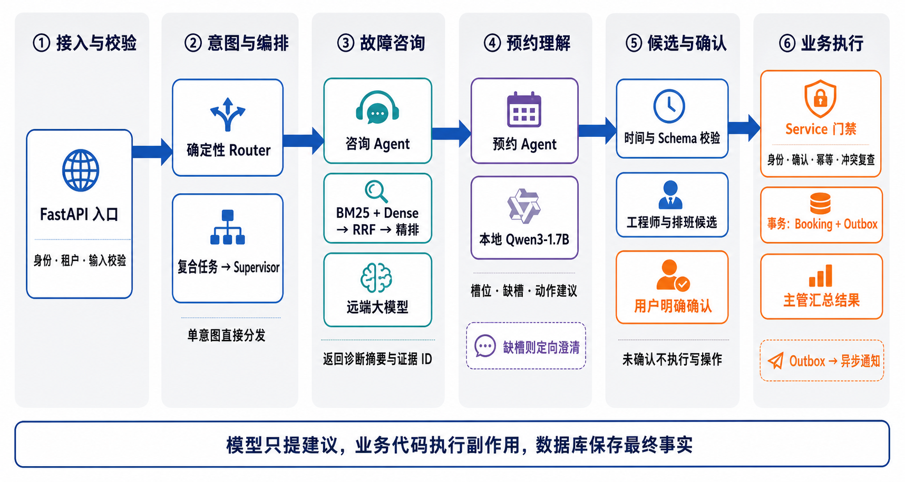
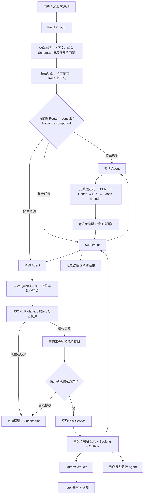
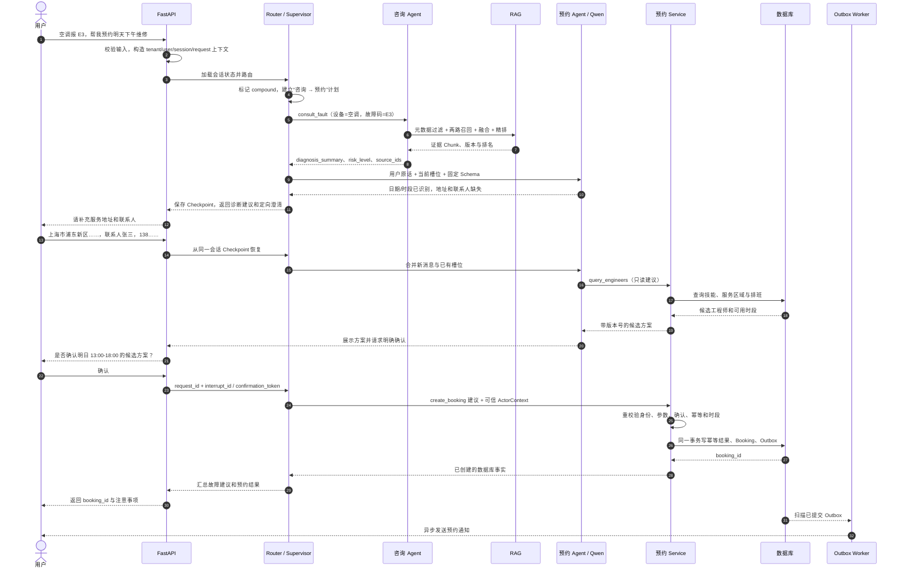
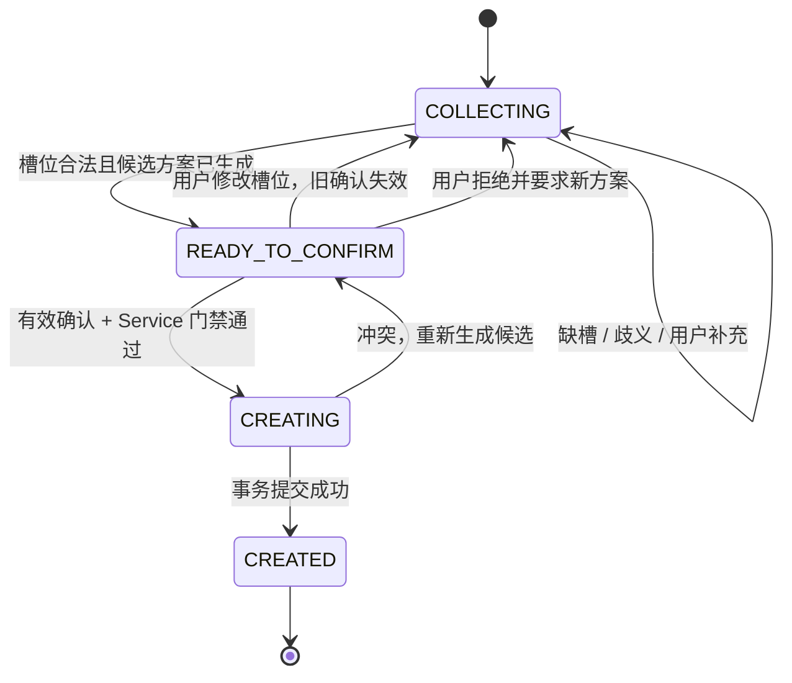

# 企业售后 Agent 系统：完整请求流程与代码映射

本文把本目录中的架构说明、面试回答和三个教学 Demo 整理成一条可讲清、可核对的项目流程。它同时回答三个问题：

1. 目标系统的一次完整业务链路如何推进；
2. Router、Supervisor、远端大模型和本地 Qwen3-1.7B 分别负责什么；
3. 当前仓库哪些部分已有代码验证，哪些仍是目标设计或生产演进方案。

## 0. 先说明证据边界

当前目录中**没有一条已经把 FastAPI、复合任务 Supervisor、真实混合 RAG、Qwen 槽位模型、工程师排班、SQLite 事务、Outbox 和 Trace 全部串起来的可执行端到端链路**。现有证据分成三个独立教学闭环：

| 教学闭环 | 主要文件 | 已验证内容 | 关键边界 |
|---|---|---|---|
| FastAPI + LangGraph | [`python_fastapi_langgraph_demo/app.py`](./python_fastapi_langgraph_demo/app.py) | API 契约、规则路由、Checkpoint、人工确认、请求重放、内存幂等和并发审批 | 没有 Supervisor、真实模型、真实 RAG、槽位抽取、数据库和 Outbox |
| Router + RAG + 工具门禁 | [`beginner_examples/agent_rag_demo.py`](./beginner_examples/agent_rag_demo.py) | `consult/booking/compound` 路由、咨询后预约、BM25/Dense/RRF 概念流程、缺槽澄清、确认门禁 | Dense、Rerank 和槽位抽取都是零依赖教学替身 |
| 可靠预约事务 | [`beginner_examples/reliable_booking_demo.py`](./beginner_examples/reliable_booking_demo.py) | SQLite 事务、请求哈希、幂等、时段冲突、Booking + Outbox、Inbox 去重 | 独立脚本，未接入 FastAPI/LangGraph，也没有真实消息队列 |

因此，面试时最准确的表述是：

> 项目材料定义了完整目标链路；当前仓库用三个教学闭环分别验证了 Router/Supervisor 概念、LangGraph 审批恢复与 HTTP 幂等、SQLite 事务与 Outbox/Inbox，真实模型、RAG、工程师匹配和生产可观测性仍需完成集成和验证。

下文使用三个标记：

- **已验证**：当前目录有可运行代码或测试；
- **目标设计**：材料中有明确流程和接口口径，但当前目录没有完整实现证据；
- **生产演进**：用于多实例、高并发和高可用，不能说成个人项目当前已经部署。

## 1. 总体架构与职责

下图是适合面试快速讲解的六阶段主流程概览；后面的 Mermaid 图和时序图进一步展示复合任务、缺槽澄清及异步通知分支。



> 图示边界：这是根据项目材料生成的目标流程概览，不表示真实 Qwen、混合 RAG、工程师匹配和生产 Trace 已经在当前仓库端到端集成。



### 1.1 组件职责边界

| 组件 | 负责 | 不负责 |
|---|---|---|
| FastAPI/API 层 | HTTP 契约、认证上下文、租户识别、输入校验、依赖注入、错误映射 | 规划多步任务、直接拼接业务 SQL |
| 确定性 Router | 粗粒度识别咨询、预约、复合或未知意图；让简单请求走快速路径 | 长时间持有任务状态、执行预约 |
| Supervisor | 持有复合任务状态，决定先咨询再预约，暂停澄清并恢复 | 绕过 Service 直接修改数据库 |
| 咨询 Agent | 查询改写、调用 RAG、生成有依据的故障建议 | 创建、修改或取消预约 |
| 预约 Agent | 收集槽位、调用本地结构化模型、查询候选方案、组织澄清和确认 | 把模型输出当成已授权业务命令 |
| 本地 Qwen3-1.7B | 槽位抽取、多轮继承与修正、缺槽/确认状态、`FINAL` 或 `TOOL_CALL` 建议 | 顶层意图路由、可靠计算日期、权限判断、数据库写入 |
| 远端大模型 | 开放式故障理解、基于证据生成、复杂跨领域规划 | 成为身份、权限或业务事实源 |
| 业务 Service | Schema、身份、租户、状态机、确认令牌、幂等、冲突和事务校验 | 相信模型传入的身份或确认事实 |
| 数据库 | 预约、排班、幂等结果等最终业务事实 | 依赖 Agent State 维持一致性 |
| Outbox/Inbox | 解决业务写入与事件发布的双写窗口，以及消费侧本地去重 | 承诺跨所有系统的绝对 Exactly Once |

核心原则是：

> Router 判断“是什么任务”，Supervisor 决定“按什么顺序完成”，模型负责“理解和提出结构化建议”，业务代码决定“是否允许执行”，数据库保存“最终事实”。

## 2. “E3 故障并预约”的完整多轮链路

用户第一句话是：

> 空调报 E3，帮我预约明天下午维修。

这句话缺少地址、联系人等必要信息，因此完整业务链路通常不是一个 HTTP 请求完成，而是至少包含“初始请求—补充槽位—确认方案”三轮。

### 2.1 时序图



### 2.2 分阶段责任链

| 阶段 | 责任组件 | 主要输入 | 主要输出 | 副作用 | 当前证据 |
|---:|---|---|---|---|---|
| 1 | FastAPI | `thread_id`、`request_id`、用户消息、Actor 上下文 | 合法请求对象 | 无 | **已验证**：Pydantic 契约、字段长度和禁止未知字段 |
| 2 | 请求与会话层 | `tenant_id + user_id + thread/session_id`、请求指纹 | 隔离后的线程键、Checkpoint、重放结果 | 无 | **已验证**：内存版锁、请求记录与 Checkpoint；持久化仍待实现 |
| 3 | 安全门禁 | 认证、租户、速率、输入和不可信内容 | 可信运行上下文或拒绝结果 | 无 | **部分验证**：输入/namespace 已有；JWT、限流和提示注入检测是目标设计 |
| 4 | Router | 当前消息和少量状态 | `consult`、`booking`、`compound` 或 `unknown` | 无 | **部分验证**：独立 Demo 支持 `compound`；FastAPI Demo 只有 `faq/booking/chat` |
| 5 | Supervisor | `compound`、任务状态、剩余预算 | “先咨询、后预约”的执行计划 | 无 | **目标设计**；独立标准库 Demo 有顺序调用概念验证 |
| 6 | 咨询 Agent/RAG | 设备、型号、故障码、租户/文档权限 | 诊断摘要、风险、证据 ID | 无 | **教学验证 + 目标设计**；真实 Embedding、Cross-Encoder 和远端模型未接入 |
| 7 | 预约 Agent/Qwen | 最新消息、已有槽位、基准时间、时区、Schema | 槽位、缺槽、确认状态、动作建议 | 无 | **目标设计**；当前规则 Demo 只抽日期、时段和地址 |
| 8 | 时间与业务校验 | “明天”“下午”等表达 | 标准日期和起止时间、校验错误 | 无 | **目标设计** |
| 9 | 澄清/Checkpoint | 缺失槽位或时间歧义 | 一个最小必要问题、可恢复状态 | 无 | **已验证**人工 interrupt/恢复机制；具体槽位状态机待集成 |
| 10 | 工程师查询 | 设备技能、地区、标准时间段 | 带版本的候选方案 | 只读 | **目标设计** |
| 11 | 用户确认 | 候选方案、版本和确认内容 | 绑定本次动作的确认结果 | 无 | **已验证**精确 `interrupt_id` 审批；候选版本 Token 仍是目标设计 |
| 12 | 预约 Service | 可信 ActorContext、候选、确认、幂等键 | 允许执行的业务命令 | 无 | **已验证**内存版身份与动作摘要校验；完整业务门禁待集成 |
| 13 | 数据库事务 | 预约命令、请求哈希、排班事实 | `booking_id`、幂等终态、Outbox 事件 | 有 | **已验证**独立 SQLite Demo |
| 14 | Supervisor/API | 诊断结果、数据库预约结果 | 面向用户的最终回答 | 无 | **目标设计** |
| 15 | Outbox/Inbox | 已提交事件、稳定 `event_id` | 通知、去重记录 | 有，可重试 | **已验证**独立模拟 Demo；真实 Broker/Worker 是生产演进 |
| 16 | 行为分析 Agent | 已完成咨询、预约和反馈事件 | 带来源的偏好或分析结果 | 后台写 | **目标设计** |

## 3. Router 与 Supervisor 的具体流程

### 3.1 Router

Router 是前置、轻量、尽量确定性的粗粒度分类器：

```text
consult  → 直接进入咨询 Agent
booking  → 直接进入预约 Agent
compound → 交给 Supervisor 持续编排
unknown  → 普通说明、澄清或人工入口
```

当前 [`agent_rag_demo.py`](./beginner_examples/agent_rag_demo.py) 的 `route()` 用关键词同时检测咨询与预约，能够产生 `compound`。当前 FastAPI Demo 的 `classify_intent()` 只是 `faq/booking/chat` 正则桩，不支持复合意图；对“E3 + 预约”这句话会优先命中预约分支。因此，复合链路属于目标架构和独立概念 Demo，尚未集成进 FastAPI 图。

### 3.2 Supervisor

Supervisor 只在复合任务中出现，并维护以下最小信息：

- 当前意图与 `task_stage`；
- 已完成能力与未决问题；
- 剩余步骤、Deadline 和调用预算；
- 咨询 Agent 返回的摘要、风险和证据引用；
- 预约 Agent 返回的槽位、候选方案和待确认动作。

专业 Agent 只接收完成本次调用所需的字段。例如咨询 Agent 返回 `diagnosis_summary`、`risk_level` 和 `source_ids`，不会把全部候选 Chunk 和内部过程复制给预约 Agent。

## 4. 咨询 Agent 与 RAG 流程

目标检索链路为：

```text
查询规范化/改写
  → tenant、产品、型号、文档版本和权限过滤
  → BM25 与 Dense 并行召回
  → RRF 融合
  → Cross-Encoder 精排
  → 远端模型基于证据生成
  → 返回 diagnosis_summary + risk_level + source_ids
```

### 4.1 为什么使用混合召回

- 故障码、型号和部件名适合 BM25 精确匹配；
- 口语症状、同义表达适合 Dense 语义召回；
- RRF 使用名次而非直接混合不同量纲的分数；
- Cross-Encoder 对较小候选集做查询—文档联合判断，提高 Top 结果相关性。

### 4.2 回退顺序

```text
Cross-Encoder 超时/失败 → 直接使用 RRF 排名
Dense 服务不可用       → BM25-only，并标记 degraded_reason
远端模型不可用         → 返回带来源的检索摘要，或稍后重试/转人工
```

降级只能降低回答质量，不能扩大工具权限。RAG 文档必须作为 `UNTRUSTED_CONTEXT`，其中的指令不能触发预约、取消或跨租户读取。

## 5. 本地 Qwen3-1.7B 的预约子流程

### 5.1 小模型所处位置

```text
Router 已确定 booking/compound
  → Supervisor 调用预约 Agent
  → 预约 Agent 构造结构化 Prompt
  → Qwen3-1.7B 输出槽位与动作建议
  → 代码解析并验证
  → 澄清、查候选或等待确认
```

Qwen 不负责顶层 Router，也不直接执行工具。它解决的是高频、边界清晰、Schema 固定的“预约域结构化理解”。

### 5.2 模型输入

预约 Agent 应传入：

- 当前用户消息；
- 已有会话槽位和每个槽位的来源；
- 当前业务阶段；
- `request_time` 和 `user_timezone`；
- 本阶段允许建议的工具白名单；
- 固定 JSON Schema，以及“缺失字段不得猜测”的约束。

概念输入示例：

```json
{
  "request_time": "2026-08-12T10:00:00+08:00",
  "user_timezone": "Asia/Shanghai",
  "task_stage": "COLLECTING",
  "latest_user_message": "空调报 E3，帮我预约明天下午维修",
  "current_slots": {},
  "allowed_tools": ["query_engineers"]
}
```

### 5.3 建议统一的模型输出协议

当前材料中的日期字段同时出现过 `date` 和 `service_date`。正式实现前应冻结唯一 Schema。为了把“语言识别”和“日期计算”分开，建议模型保留原始时间表达，再由确定性时间服务生成标准字段：

```json
{
  "action": "FINAL",
  "slots": {
    "device": "空调",
    "fault_code": "E3",
    "service_date_text": "明天",
    "time_range_text": "下午",
    "service_address": null,
    "contact_name": null,
    "contact_phone": null
  },
  "missing_slots": [
    "service_address",
    "contact_name",
    "contact_phone"
  ],
  "need_confirmation": false
}
```

这里的 `FINAL` 只表示“本轮返回结构化结果，不提出工具调用”，不表示预约已经创建。只有在状态机允许、参数完整且服务端门禁通过时，模型才可以提出 `TOOL_CALL`；它仍然只是一条不可信建议。

### 5.4 校验顺序

```text
JSON 解析
  → Pydantic / JSON Schema
  → 字段枚举和长度
  → 确定性时间解析
  → 多轮槽位继承与冲突
  → 当前业务状态
  → 工具白名单
  → 身份与租户
  → 用户确认与确认令牌
  → 幂等和数据库事务
```

模型只识别“明天、下周五、下午”等语言片段；时间服务使用 `request_time + user_timezone` 计算标准时间，再校验歧义、营业时间和时区。不能让模型自行把相对日期当成最终业务事实。

### 5.5 失败与升级

- JSON 或 Schema 错误：在剩余 Deadline 内最多做一次带错误反馈的受控修复；
- 仍然失败、关键字段低置信或输入过于复杂：升级远端结构化模型；
- 本地模型服务不可用：低风险场景可使用规则抽取或远端模型；
- 推理槽位拥塞：使用有界队列，超过等待预算后返回 `Retry-After` 或对低风险任务降级；
- 高风险写操作：不得为了可用性切换到未经验证的模型后自动执行。

无论如何降级，都不能跳过身份、确认、幂等和事务门禁。

## 6. 会话状态、槽位状态和业务状态机

### 6.1 三种状态不能混用

| 状态 | 示例 | 事实地位 |
|---|---|---|
| Agent 工作状态 | 当前意图、已调用能力、下一步、剩余预算 | 仅用于工作流推进 |
| 会话/槽位状态 | 设备、故障、时间表达、地址、候选方案、确认令牌 | 辅助对话，必须保留来源 |
| 数据库业务事实 | 已创建预约、工程师排班、幂等终态 | 最终事实源 |

Checkpoint 只保存工作流恢复点，不能替代预约事务、幂等记录或数据库约束。

### 6.2 建议的槽位元数据

每个槽位不是单独一个字符串，而应至少包含：

```json
{
  "value": "明天下午",
  "source_message_id": "message-001",
  "updated_at": "2026-08-12T10:00:00+08:00",
  "confidence": 0.98,
  "confirmed": false
}
```

用户后来明确说“改成周五上午”时，只覆盖日期和时段；设备、故障和地址继续继承。最新显式指令优先，但要保留来源和修改记录。

### 6.3 预约状态机



候选方案必须带版本或摘要哈希。确认之后如果用户修改时间、地址或工程师，旧确认令牌立即失效，不能拿旧确认执行新参数。

## 7. 确认、幂等和预约事务

### 7.1 用户确认

当前 FastAPI + LangGraph Demo 已验证：

- `interrupt()` 暂停预约图；
- 客户端必须带回精确的 `request_id + interrupt_id`；
- `approved` 使用严格布尔值；
- 错误、过期或跨用户的 interrupt 不能恢复；
- 并发批准/拒绝只能有一个决定生效；
- 审批后节点失败可以从 Checkpoint 恢复。

生产实现还应把确认绑定到候选方案版本、规范化参数摘要和有效期，而不只是绑定一个布尔值。

### 7.2 Service 执行前重新校验

Service 不接受模型提供的身份作为可信数据，而是从 ActorContext 和数据库重新取得事实，至少校验：

1. 用户和租户；
2. 工具名与动作 Schema；
3. 设备、地址、联系人和时间范围；
4. 候选工程师的技能、服务区域和最新排班；
5. 确认令牌、候选版本和当前状态；
6. 幂等键与规范化参数哈希；
7. 数据库中的最新时段冲突。

### 7.3 SQLite 教学事务的真实顺序

[`reliable_booking_demo.py`](./beginner_examples/reliable_booking_demo.py) 验证的顺序是：

```text
BEGIN IMMEDIATE
  → 查询 idempotency_record
  → 相同 Key + 不同 request_hash：拒绝
  → 相同 Key + SUCCEEDED：返回原 booking_id
  → 首次请求：插入 PROCESSING
  → 在事务内重新检查工程师时间冲突
  → 插入 Booking
  → 插入 BOOKING_CREATED Outbox 事件
  → 更新幂等记录为 SUCCEEDED 并保存响应
COMMIT
```

当前 SQLite Demo 的事务表包括 Booking、Idempotency、Outbox、Inbox 和 Notification Log，**没有审计表**。审计记录和 OpenTelemetry Trace 属于目标设计，不能描述为该 Demo 已在同一事务中实现。

## 8. Outbox、Inbox 与异步处理

预约和通知不能用“先写数据库，再直接发消息”的方式完成，否则任意一步失败都会造成双写不一致。

目标语义为：

```text
预约业务效果：相同幂等键至多创建一份
Outbox 事件：至少一次发布
Inbox 本地消费效果：按 event_id 去重
外部短信：是否重复仍取决于供应商幂等能力
```

可靠预约 Demo 已模拟以下失败窗口：Worker 发布事件后、标记 Outbox 为 `SENT` 前崩溃；恢复后事件会再次发布，消费者使用 Inbox 识别相同 `message_id`，避免重复写本地通知记录。

生产环境还需要真实 Broker、独立 Worker、指数退避和 Jitter、死信处理、Outbox 最老积压告警，以及对外部供应商传递稳定幂等键。

## 9. Trace、审计和可观测流程

目标链路在入口创建一个 Trace ID，并为以下阶段建立 Span：

```text
FastAPI 请求
  ├─ 会话读取 / 幂等检查
  ├─ Router
  ├─ Supervisor step
  ├─ 咨询 Agent
  │   ├─ BM25
  │   ├─ Dense
  │   ├─ RRF
  │   ├─ Rerank
  │   └─ 远端模型
  ├─ 预约 Agent
  │   ├─ 本地 Qwen
  │   ├─ 时间解析
  │   └─ 工程师查询
  └─ Booking Service / DB transaction
```

建议记录模型版本、Token、耗时、重试、检索候选 ID、排名变化、工具名、参数摘要、数据库结果和 `degraded_reason`，但不记录模型隐藏思维链，也不默认保存完整敏感原文。

当前 FastAPI Demo 的 `events` 只是内存 Agent State，不是 OpenTelemetry Span；当前仓库也没有可展示的真实 Trace 和持久审计表。因此这部分必须标为**目标设计**。

## 10. 失败与降级总表

| 故障 | 处理方式 | 不允许的做法 |
|---|---|---|
| Router 低置信 | 澄清或进入受限 Supervisor | 随机选择高风险工具 |
| Dense 不可用 | 回退 BM25-only，记录降级原因 | 伪装成完整混合检索 |
| Cross-Encoder 超时 | 使用 RRF 排名 | 无限重试拖垮总 Deadline |
| 远端模型 429/超时 | 有依据摘要、稍后重试或转人工 | 无证据生成复杂故障结论 |
| 本地 Qwen Schema 错误 | 一次受控修复，仍失败则升级远端 | 循环重试或解析残缺 JSON |
| 本地模型拥塞 | 有界队列、低风险降级、`Retry-After` | 无限排队推高 P95 |
| 槽位缺失/时间歧义 | 只询问最小必要信息 | 脑补地址、联系人或日期 |
| 用户确认后修改槽位 | 旧令牌失效，重新查候选和确认 | 用旧确认执行新参数 |
| 数据库时段冲突 | 回滚并返回新候选 | 在内存中假装预约成功 |
| 副作用结果未知 | 先按幂等键/operation ID 对账 | 直接再次创建预约 |
| 通知失败 | 预约保持已提交，Outbox 重试 | 回滚已经成功的预约 |
| Outbox 重复发布 | Inbox/业务唯一约束去重 | 宣称 Broker 自动保证端到端 Exactly Once |

## 11. 当前代码与目标流程的映射

### 11.1 FastAPI + LangGraph Demo

入口与状态：

- `ChatRequest`：`thread_id`、`request_id`、`message`；
- `ReviewRequest`：额外包含 `interrupt_id` 和严格布尔 `approved`；
- `RunContext`：可信的 `tenant_id`、`user_id`、`operation_id`；
- `AgentState`：消息、事件、意图、文档、待确认动作、审批结果和预约号。

实际图：

```text
START
  → classify_intent
      ├─ faq → retrieve_documents → answer_faq → END
      ├─ chat → answer_chat → END
      └─ booking → draft_booking → interrupt
                       ├─ approve → execute_booking → END
                       └─ reject  → reject_booking  → END
```

该 Demo 的规则分类器、固定检索文档、`InMemorySaver`、请求 Store、BookingService 和 thread 锁都是教学替身。详细运行方式见 [`python_fastapi_langgraph_demo/README.md`](./python_fastapi_langgraph_demo/README.md)。

### 11.2 Router + RAG Demo

实际概念流程：

```text
route(text)
  → consult：consultation_agent
  → booking：booking_agent
  → compound：consultation_agent → booking_agent
```

它验证 `compound` 分流、BM25/Dense/RRF 顺序、产品元数据过滤、缺地址澄清，以及未确认时禁止执行创建工具。其 Dense 是手写概念向量，Rerank 是规则打分，槽位抽取也是正则/日期规则。

### 11.3 SQLite 可靠预约 Demo

它独立验证：

- 同一 Idempotency-Key + 相同参数返回原预约；
- 同一 Key + 不同参数产生冲突；
- 事务内重新检查工程师时段；
- Booking 和 Outbox 同时提交或同时回滚；
- Outbox 重发时由 Inbox 去重本地通知效果。

## 12. 建议的集成顺序

1. 把 FastAPI Demo 的 Router 扩展为 `consult/booking/compound/unknown`，为复合分支加入 Supervisor；
2. 把 `agent_rag_demo.py` 的接口抽象接入图，但先保留替身，补齐端到端测试；
3. 冻结预约槽位 JSON Schema，统一日期字段，并实现时间服务和多轮槽位合并；
4. 接入 Qwen 适配器，加入 Schema 修复、低置信升级和固定 51 条回归集；
5. 把内存 BookingService 替换为可靠预约 Repository/Service，接入 SQLite 事务 Demo；
6. 把确认绑定到候选版本和参数哈希，补工程师查询与并发冲突测试；
7. 接入 Outbox Worker/Inbox，再补真实消息代理故障演练；
8. 最后接入真实混合 RAG、远端模型、JWT/ACL、持久 Checkpoint、审计和 OpenTelemetry。

每完成一步，都应保留上一步的契约测试，避免同时替换模型、检索、状态和事务后无法定位问题。

## 13. 面试时的一句话版本

> 请求进入 FastAPI 后先建立可信的用户、租户、会话和幂等上下文，再由确定性 Router 判断咨询、预约或复合任务；简单请求直达专业 Agent，复合任务交给 Supervisor。咨询 Agent 通过混合 RAG 和远端模型生成带证据建议，预约 Agent 使用本地 Qwen 提取槽位和提出动作建议；缺槽就暂停澄清，完整后查询候选并要求用户确认。确认后业务 Service 重新校验身份、参数、状态、幂等和时段冲突，在事务中写 Booking 与 Outbox，最后由 Supervisor 汇总结果，异步 Worker 负责通知。模型始终不能直接写数据库。

## 14. 主要依据

- 总体口径与证据边界：[`README.md`](./README.md)、[`consistency_check.md`](./consistency_check.md)
- 完整责任链与基础原理：[`beginner_tutorial.md`](./beginner_tutorial.md)
- 一线 Agent 面试回答：[`interviewer_1_agent.md`](./interviewer_1_agent.md)
- 架构、模型路由和可观测性：[`interviewer_2_architect.md`](./interviewer_2_architect.md)
- 稳定性、重试和并发：[`interviewer_3_reliability.md`](./interviewer_3_reliability.md)
- 状态图、事务和训练样例：[`onsite_tasks.md`](./onsite_tasks.md)
- FastAPI/LangGraph 教学实现：[`python_fastapi_langgraph_demo/app.py`](./python_fastapi_langgraph_demo/app.py)、[`test_app.py`](./python_fastapi_langgraph_demo/test_app.py)
- Router/RAG/门禁教学实现：[`beginner_examples/agent_rag_demo.py`](./beginner_examples/agent_rag_demo.py)
- SQLite/Outbox/Inbox 教学实现：[`beginner_examples/reliable_booking_demo.py`](./beginner_examples/reliable_booking_demo.py)
